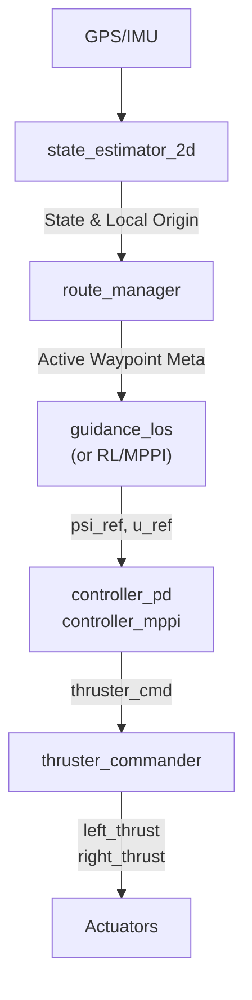

# VRX Autonomous Navigation Benchmark: LOS + MPPI + RL


A complete, modular autonomy stack and benchmarking framework for the **WAM-V 16** marine surface vessel within the **[Virtual RobotX (VRX)](https://github.com/osrf/vrx)** simulation environment. 

This repository serves as the official codebase for comparative analysis between:
1. Traditional deterministic control (**LOS+PD**)
2. Optimal predictive heuristic control (**LOS+MPPI**)
3. Hybrid offline Reinforcement Learning residual policy (**LOS+MPPI+RL**) 

Designed with strict zero-shot physical evaluations in mind, this package facilitates testing under progressively challenging atmospheric variables (wind, waves, currents).

---

## 🎯 Executive Summary
This framework provides a generalized pipeline to navigate complex waypoint geometries (straight segments, continuous curves, and acute zigzags). It seamlessly isolates **State Estimation**, **Route Management**, **Guidance**, and **Low-level Control**, ensuring researchers can rapidly prototype and benchmark novel autonomy algorithms for Unmanned Surface Vehicles (USVs).

The benchmark autonomously registers highly detailed Time-Series telemetry (at 10/20Hz) and discrete transition events, ultimately used to evaluate robustness, spatial constraints (cross-track error), and thrust actuation smoothness.

---

## 🏗 System Architecture

The ecosystem relies on an asynchronous ROS 2 architecture spanning specialized nodes:



### Module Breakdown
* **`state_estimator_2d`**: High-frequency ENU local frame fusion mapping raw GPS/IMU to 2D Odometry using Exponential Moving Averages (EMA).
* **`route_manager`**: Stateful milestone tracking managing `start`, `transit`, and `finish` maneuver envelopes. Injects mathematically robust spatial capture tolerances.
* **`route_utils`**: Core mathematical library parsing geodetic matrices and vectors for safe navigation routing.
* **`guidance_los`**: Lookahead Adaptive Line-of-Sight steering. Computes curvature-aware geometries linking directly to underlying controllers.
* **`controller_mppi` / `controller_pd` / `controller_rl_residual`**: Translation solvers spanning basic Proportional-Derivative actuation, nonlinear Model Predictive Path Integrals, and the experimental TD3+BC RL agent.
* **`train_rl_residual`**: Dedicated Offline TD3+BC policy trainer generating and iterating optimized network parameters.
* **`thruster_commander`**: Direct bridge translating logical Newton matrices from evaluating controllers securely into gazebo bounds.
* **`metrics_logger`**: The central evaluation core caching telemetry directly into local `.csv` summary grids.

---

## 📁 Repository Structure

```text
vrx_experiment_benchmark/
├── config/
│   ├── env/                      # Sub-configs for atmospheric turbulence models
│   ├── routes/                   # Benchmark YAML geometric path definitions
│   ├── pd_config.yaml            # Classical control boundary parameters
│   ├── los_config.yaml           # Curvature and Lookahead coefficients
│   ├── mppi_config.yaml          # Predictive integral bounds
│   └── rl_models/                # Exported TorchScript policies for residual control
├── launch/                       # Single-command environment and module execution scripts
├── metrics/                      # Output directory containing 10Hz evaluation dumps
├── scripts/                      # Utility shell scripts (e.g., config live-sync)
├── vrx_experiment_benchmark/     # Autonomous Core Source Code (Python Modules)
└── worlds/                       # Autogenerated Jinja macro templates for Gazebo Garden
```

---

## 💻 Installation & Build Guide

Targeting standard ROS 2 Humble environments on Ubuntu 22.04.

```bash
cd ~/ros2_ws/src
git clone https://github.com/MisaelMQ/vrx_experiment_benchmark.git
cd ~/ros2_ws

# Standard Colcon Build Setup
colcon build --packages-select vrx_experiment_benchmark
source install/setup.bash
```

> **Developer Note:** A fast-sync script is explicitly provided to rapidly inject modified `.py` and `.yaml` configurations into the install space without waiting for lengthy `colcon build` cycles. This is immensely valuable for hyperparameter tuning!
> ```bash
> bash src/vrx_experiment_benchmark/scripts/sync_config.sh
> ```

---

## 🚀 Usage & Diagnostics Execution

The framework is meant to be run concurrently with the VRX simulation environment. The simulation encapsulates different atmospheric constraints ranging from perfectly still to severe squalls.

### 1) Experiment Launcher (Atmospheric Configurations)
First, initialize the simulated physics environment using our autogenerated macros:

```bash
source install/setup.bash

# Run an environment with severe multidirectional sea turbulence
ros2 launch vrx_experiment_benchmark experiment.launch.py env:=env_05_severe
```

**Available Atmospheric Environments:**
* `env_01_calm`: Minimal to no weather perturbations.
* `env_02_low`: Mild wind streams, virtually negligible drag.
* `env_03_medium`: Competing wind and wake flows. 
* `env_04_high`: Heavy wind with noticeable physical displacement on the vessel hull.
* `env_05_severe`: Extreme stochastic wind profiles and wave amplitudes.

### 2) Route & Autonomy Launcher
Once the simulator executes the environment, spawn the navigation and evaluation telemetry stack in parallel:

```bash
# Classical Guidance (LOS+PD) across sweeping curves
ros2 launch vrx_experiment_benchmark route_following_pd.launch.py route_name:=route_curves.yaml

# Predictive MPPI Controller targeting acute geometries
ros2 launch vrx_experiment_benchmark route_following_mppi.launch.py route_name:=route_zigzag.yaml
```

**Available Geometric Routes:**
* `route_straight.yaml`: Pure linear sprint benchmarking longitudinal drag compensation.
* `route_curves.yaml`: Continuous long-radius maneuvers preventing actuation spikes.
* `route_zigzag.yaml`: Sharp, acute turning tests designed to stress overshoot and differential slip.

---

## 📈 Metrics & Benchmark Results

The native `metrics_logger.py` caches performance telemetry inside the local `metrics/raw` and `metrics/summary` directories. Output logs automatically categorize runs tagging the executed node, controller structure, timestamp, and weather variables.

**Key Experimental Observations:**
1. **Superior Lateral Precision**: The hybrid **MPPI+RL** strategy yields the tightest cross-track error (CTE) during transit, reducing error by **60.3%** compared to the PD baseline.
2. **Environment Invariance**: The RL residual policy demonstrates extraordinary consistency facing extreme environmental wind shear, scoring a Transit CTE standard deviation of **σ = 0.035 m** (nearly 9× lower variance than pure MPPI predictions).
3. **Actuation Smoothness**: Contrary to expectations of noisy RL command envelopes, the **MPPI+RL** framework natively outputs **18.8% smoother** thrust command gradients (N/step variation) than analytical controls, vastly reducing mechanical wear.

### Average Evaluation (Transit Phase)
| Controller Stack | RMS CTE [m] | Commanded Speed Ratio | Actuator Variational Gradient [N/step]| Global Integrity|
|------------------|-------------|-----------------------|----------------------------------------|-----------------|
| LOS+PD           | 3.775 ± 1.13| 0.643 ± 0.05          | 95.0 ± 183.6                           | 86.7%           |
| LOS+MPPI         | 1.583 ± 0.47| 0.894 ± 0.20          | 69.7 ± 31.5                            | 100%            |
| **LOS+MPPI+RL**  | **1.498 ± 0.45**| **0.964 ± 0.16**      | **56.6 ± 26.2**                        | **100%**        |

---

## 🔧 Extensibility: Writing your own Algorithm

This architecture explicitly grants users the capability to swap out intermediate evaluation schemas. To test a novel Model Predictive Controller or Soft Actor-Critic script:

1. Map inbound observations to the standard positional matrix exported by `/wamv/navigation/state2d` and `/wamv/navigation/active_waypoint_meta`.
2. Compute constraints and publish final actuation values strictly via the `/wamv/control/guidance_cmd` manifold (expecting an array of exactly 12 fields).
3. Append your executable to the python `setup.py` build graph.
4. Auto-evaluate your implementation via the onboard logging infrastructure.

For full protocol specification and node relationships, read the included `CONTEXT.md` documentation.

---

## 🙏 Attributions
* **Virtual RobotX (VRX)**: Official dynamics models originated from the open-source marine simulation packages supplied by [Open Robotics](https://github.com/osrf/vrx).
* **Research Documentation**: Analysis, algorithm development, and architectural design produced by MisaelMQ for Advanced Autonomous Robotics integration.
